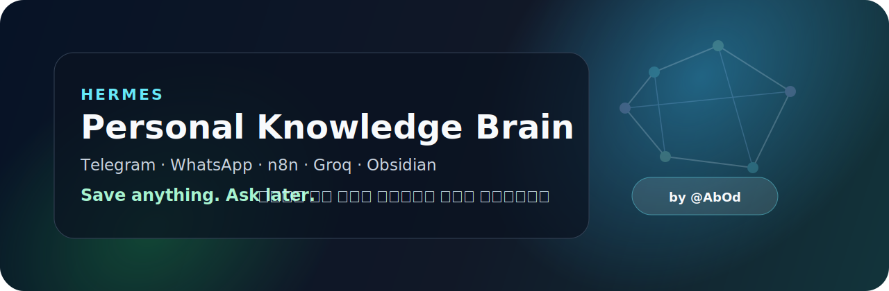

# Hermes Personal Knowledge Brain

> **English first, Arabic below.** A self-hosted personal knowledge brain for Telegram, WhatsApp, and Obsidian. Send links, voice notes, or images. Hermes summarizes them, organizes them into Markdown, and lets you ask about them later.

Built by **Abdullah Altamimi** · [X @AbOd](https://x.com/AbOd) · [First iPhone app: Aish Awfar](https://apps.abod.ws/aish)

If this project helps you, you can use my [Hostinger referral link](https://www.hostinger.com?REFERRALCODE=GIQKABOD9A2H) when setting up your VPS.

---

## English

### Why I Built This

I was saving links in bookmarks, sending messages to myself, keeping screenshots, and dropping notes across apps. The problem was not saving information. The problem was finding it again.

Hermes turns Telegram and WhatsApp into a capture layer for your personal knowledge. It saves what you send, summarizes it with AI, places it into useful categories, and keeps everything in Markdown so you can browse it later in Obsidian.

### What It Can Save

- **Links**: webpage, YouTube, TikTok, Instagram, X/Twitter, Reddit, and Telegram links
- **Voice notes**: automatic transcription in Arabic, English, and more
- **Images**: AI vision description and categorization
- **Personal notes**: add context after any URL
- **Reminders**: attach future reminders such as `/remind 2weeks`

### Core Features

- AI summarization and categorization
- Tags and custom rules
- Natural-language Q&A over saved knowledge
- Daily digest and weekly report
- Guest access for selected categories
- Obsidian-friendly Markdown vault
- Telegram and WhatsApp support
- Low-cost self-hosted setup

### Demo

```text
You:
https://example.com/article this is useful for my AI agent project /remind 2weeks

Hermes:
Saved to ai
Tags: #agents #automation #research
Summary: ...

You later:
What did I save about AI agents?

Hermes:
Here are the most relevant saved links...
```

### Architecture

```text
Telegram / WhatsApp
       |
       v
n8n workflows
       |
       +-- Save links       -> Firecrawl, yt-dlp, oEmbed
       +-- Transcribe audio -> Groq Whisper
       +-- Analyze images   -> Groq Vision
       +-- Answer questions -> Groq LLaMA
       |
       v
Markdown knowledge vault on VPS
       |
       v
Private GitHub repo
       |
       v
Obsidian on Mac / iPhone
```

### Files Included

| File | Purpose |
| --- | --- |
| `README.md` | Project overview and setup guide |
| `github_banner.svg` | GitHub banner |
| `launch-post.md` | English/Arabic launch post |
| `Bot_Commands_Reference_AR_EN.pdf` | Bot command reference |
| `config.example.json` | Safe placeholder config |
| `index.js` | WhatsApp bridge |
| `package.json` | WhatsApp bridge dependencies |
| `whisper-api.py` | Groq Whisper helper API |
| `ytdlp-api.py` | Video metadata/transcript helper API |
| `n8n.zip` | n8n workflow exports |

### Requirements

- VPS with Ubuntu 24.04, 4 GB RAM recommended
- n8n, self-hosted with Docker
- Groq API key
- Firecrawl API key
- Telegram bot token from [@BotFather](https://t.me/BotFather)
- Optional: WhatsApp number for the WhatsApp bridge
- Optional: Obsidian for browsing the Markdown vault

### Setup Summary

1. Get a VPS. I used Hostinger; my referral link is [https://www.hostinger.com?REFERRALCODE=GIQKABOD9A2H](https://www.hostinger.com?REFERRALCODE=GIQKABOD9A2H).
2. Install n8n on the VPS.
3. Copy `config.example.json` to `/root/config.json` and fill in your own keys.
4. Install the helper scripts:

```bash
pip3 install yt-dlp --break-system-packages
cp ytdlp-api.py /root/ytdlp-api.py
cp whisper-api.py /root/whisper-api.py
```

5. Mount `/root/config.json` and `/root/knowledge` into n8n.
6. Import the workflows from `n8n.zip`.
7. Add Telegram credentials to the Telegram nodes.
8. Activate the workflows.
9. Optional: run the WhatsApp bridge from `index.js`.
10. Optional: sync `/root/knowledge` with a private GitHub repo and open it in Obsidian.

### Security Notes

- Do not commit your real `config.json`.
- Do not commit your knowledge vault.
- Keep Telegram, Groq, Firecrawl, GitHub, and WhatsApp secrets private.
- Use a private GitHub repo for your actual knowledge.
- Keep n8n behind strong authentication and HTTPS.
- Do not expose helper APIs directly to the public internet.
- Replace broad permissions with stricter permissions after first setup.

### Bot Commands

See [`Bot_Commands_Reference_AR_EN.pdf`](Bot_Commands_Reference_AR_EN.pdf) for the complete command reference.

### About Me

Built by **Abdullah Altamimi**.

- X: [@AbOd](https://x.com/AbOd)
- First iPhone app: [Aish Awfar](https://apps.abod.ws/aish)
- VPS referral: [Hostinger](https://www.hostinger.com?REFERRALCODE=GIQKABOD9A2H)

---

## العربية

### لماذا بنيت هذا المشروع؟

كنت أحفظ الروابط في المفضلة، وأرسل لنفسي رسائل، وأحتفظ بالصور والملاحظات في أكثر من تطبيق. المشكلة لم تكن في الحفظ، بل في الرجوع للمعلومة وقت الحاجة.

Hermes يحول تيليغرام وواتساب إلى طبقة التقاط للمعرفة الشخصية. أرسل رابطاً أو ملاحظة صوتية أو صورة، وسيقوم النظام بتلخيصها وتصنيفها وحفظها في ملفات Markdown مناسبة للتصفح داخل Obsidian.

### ماذا يستطيع حفظه؟

- **الروابط**: صفحات الويب ويوتيوب وتيك توك وإنستغرام و X وريديت وتيليغرام
- **الملاحظات الصوتية**: تفريغ صوتي تلقائي بالعربية والإنجليزية وغيرها
- **الصور**: وصف وتحليل بالذكاء الاصطناعي
- **ملاحظاتك الشخصية**: أضف سياقاً بعد أي رابط
- **التذكيرات**: مثل `/remind 2weeks`

### المميزات الأساسية

- تلخيص وتصنيف بالذكاء الاصطناعي
- وسوم وقواعد تصنيف مخصصة
- أسئلة طبيعية على المعرفة المحفوظة
- ملخص يومي وتقرير أسبوعي
- وصول محدود للضيوف حسب الفئات
- ملفات Markdown متوافقة مع Obsidian
- دعم تيليغرام وواتساب
- تشغيل ذاتي بتكلفة منخفضة

### مثال سريع

```text
أنت:
https://example.com/article هذا مفيد لمشروع وكلاء الذكاء الاصطناعي /remind 2weeks

Hermes:
تم الحفظ في ai
الوسوم: #agents #automation #research
الملخص: ...

أنت لاحقاً:
ما الذي حفظته عن وكلاء الذكاء الاصطناعي؟

Hermes:
هذه أكثر الروابط المحفوظة صلة...
```

### الملفات الموجودة

| الملف | الاستخدام |
| --- | --- |
| `README.md` | شرح المشروع وطريقة الإعداد |
| `github_banner.svg` | بانر GitHub |
| `launch-post.md` | منشور الإطلاق بالإنجليزية والعربية |
| `Bot_Commands_Reference_AR_EN.pdf` | دليل أوامر البوت |
| `config.example.json` | ملف إعدادات آمن بقيم وهمية |
| `index.js` | جسر واتساب |
| `package.json` | اعتماديات جسر واتساب |
| `whisper-api.py` | خدمة تفريغ الصوت عبر Groq Whisper |
| `ytdlp-api.py` | خدمة معلومات الفيديو والترجمة |
| `n8n.zip` | ملفات سير العمل الخاصة بـ n8n |

### ملخص الإعداد

1. احصل على VPS. استخدمت Hostinger، وهذا رابط الإحالة الخاص بي: [https://www.hostinger.com?REFERRALCODE=GIQKABOD9A2H](https://www.hostinger.com?REFERRALCODE=GIQKABOD9A2H).
2. ثبّت n8n على الخادم.
3. انسخ `config.example.json` إلى `/root/config.json` وضع مفاتيحك الخاصة.
4. ثبّت السكربتات المساعدة.
5. اربط `/root/config.json` و `/root/knowledge` داخل n8n.
6. استورد سير العمل من `n8n.zip`.
7. أضف بيانات تيليغرام إلى عقد تيليغرام داخل n8n.
8. فعّل سير العمل.
9. اختياري: شغّل جسر واتساب.
10. اختياري: زامن مجلد المعرفة مع مستودع GitHub خاص وافتحه في Obsidian.

### ملاحظات الأمان

- لا ترفع ملف `config.json` الحقيقي.
- لا ترفع مجلد المعرفة الشخصي.
- حافظ على سرية مفاتيح Telegram و Groq و Firecrawl و GitHub و WhatsApp.
- استخدم مستودع GitHub خاصاً للمعرفة الفعلية.
- اجعل n8n خلف تسجيل دخول قوي و HTTPS.
- لا تكشف خدمات المساعدة مباشرة للإنترنت.
- بعد الإعداد الأولي، استبدل الصلاحيات الواسعة بصلاحيات أضيق.

### عن المطور

بني بواسطة **Abdullah Altamimi**.

- X: [@AbOd](https://x.com/AbOd)
- تطبيقي الأول على الآيفون: [Aish Awfar](https://apps.abod.ws/aish)
- رابط Hostinger للإحالة: [Hostinger](https://www.hostinger.com?REFERRALCODE=GIQKABOD9A2H)

## License

MIT. Use it, modify it, and build your own second brain.
